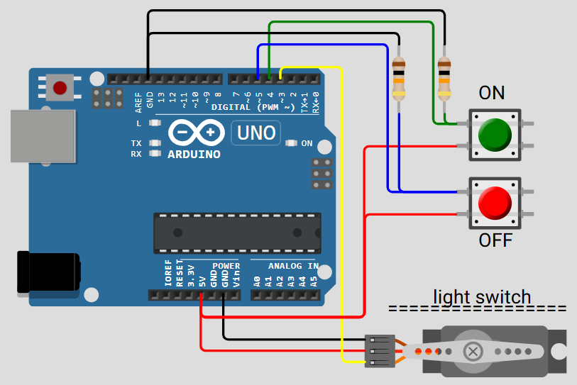

# Arduino Bedroom Light Controller

This Arduino project was created to solve a common inconvenience: turning the bedroom light on or off without getting out of bed.

## Overview

The system uses two push buttons to control the light:
- One button to turn the light **on**
- Another button to turn the light **off**

A servo motor is responsible for physically toggling the light switch to the selected state.

## How It Works

- The servo motor rests at a neutral position of **90 degrees**.
- When a button is pressed, the servo rotates to activate the light switch.
- It holds that position for **1 second**.
- After that, it returns to the neutral position, ready for the next command.

## Wiring Diagram

Below is the wiring diagram for the project:

## Components Used

- Arduino board (e.g., Uno, Nano)
- 2x Push buttons
- 1x Servo motor (e.g., SG90)
- Wires and basic prototyping materials

## Use Case

Perfect for bedside control of traditional light switches, especially in setups where smart bulbs or wireless solutions are not available.

---

Feel free to customize the servo angles or delay duration to match the physical switch you're using.
